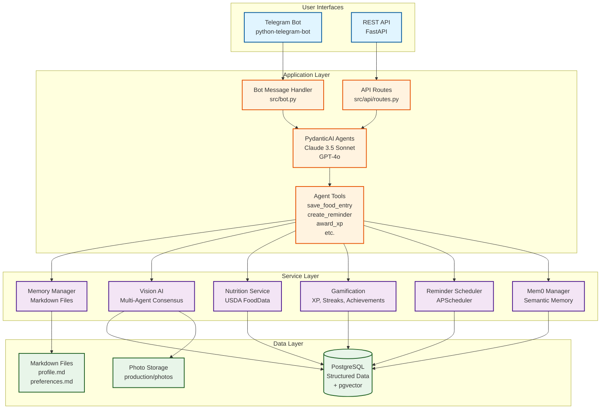
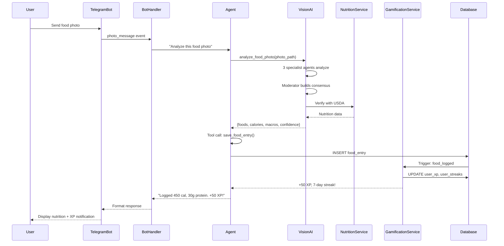
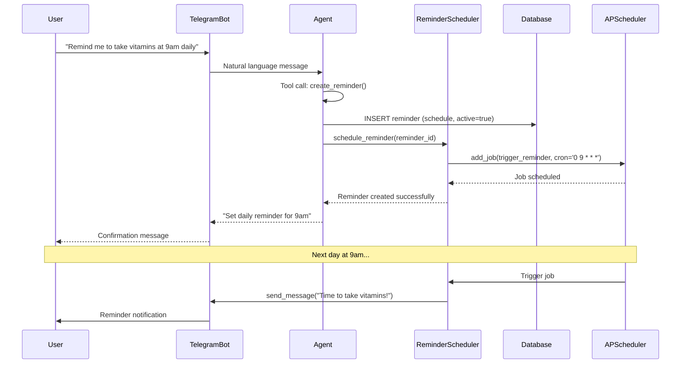
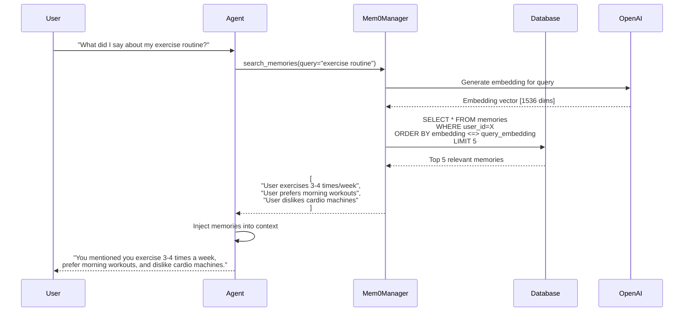

# System Component Architecture

This document provides a high-level overview of the Health Agent's component architecture, showing how different parts of the system interact.

## Overview

The Health Agent is organized into four main layers:
1. **User Interfaces** - Telegram bot and REST API
2. **Application Layer** - Message handling and agent orchestration
3. **Service Layer** - Business logic services (vision AI, gamification, memory, etc.)
4. **Data Layer** - PostgreSQL database, Markdown files, and Mem0 semantic memory

## Component Diagram



## Component Descriptions

### User Interfaces Layer

#### Telegram Bot
- **Technology**: python-telegram-bot library
- **Purpose**: Primary user interface for health tracking
- **Key Features**:
  - Message handling (text, photos, commands)
  - Inline keyboards for interactive responses
  - Topic-based filtering (multi-user support)
  - Photo upload handling
- **Location**: `src/bot.py`

#### REST API
- **Technology**: FastAPI
- **Purpose**: Programmatic access for testing (SCAR) and future integrations
- **Key Features**:
  - OpenAPI documentation (auto-generated at `/docs`)
  - API key authentication
  - Rate limiting
  - Mirrors bot functionality via HTTP endpoints
- **Location**: `src/api/app.py`, `src/api/routes.py`

### Application Layer

#### Bot Message Handler
- **Purpose**: Receives and routes Telegram messages
- **Responsibilities**:
  - Message parsing (text, photos, commands)
  - User authentication (Telegram ID whitelist)
  - Conversation history management
  - Response formatting for Telegram
- **Flow**: Telegram → Handler → Agent Core → Handler → Telegram

#### API Routes
- **Purpose**: HTTP endpoint handlers
- **Responsibilities**:
  - Request validation (Pydantic models)
  - API key authentication
  - Rate limit enforcement
  - Response serialization (JSON)
- **Flow**: HTTP Request → Routes → Agent Core → Routes → HTTP Response

#### PydanticAI Agent Core
- **Technology**: PydanticAI framework
- **Models**:
  - Claude 3.5 Sonnet (primary agent)
  - GPT-4o (fallback agent)
- **Responsibilities**:
  - Natural language understanding
  - Tool selection and orchestration
  - Response generation
  - Conversation context management
- **System Prompt**: Defines agent personality and capabilities
- **Location**: `src/agent/__init__.py`

#### Agent Tools
- **Purpose**: Executable functions the agent can call
- **Key Tools**:
  - `save_food_entry()` - Log food with nutrition data
  - `create_reminder()` - Schedule health reminders
  - `update_profile()` - Modify user demographics
  - `save_preference()` - Update user preferences
  - `get_daily_food_summary()` - Query food history
  - `get_user_xp()` - Retrieve gamification stats
  - `browse_challenges()` - View available challenges
  - Dynamic tools (user-created custom trackers)
- **Pattern**: Tools receive `RunContext[AgentDeps]` for dependency injection
- **Location**: `src/agent/__init__.py`

### Service Layer

#### Memory Manager
- **Purpose**: Manage user configuration in Markdown files
- **Responsibilities**:
  - Read/write `profile.md` (demographics, goals)
  - Read/write `preferences.md` (communication style, settings)
  - Manage dynamic tool definitions
- **Storage**: `production/data/{user_id}/`
- **Location**: `src/memory/file_manager.py`

#### Vision AI (Multi-Agent Consensus)
- **Purpose**: Analyze food photos for nutrition estimation
- **Architecture**:
  - 3 specialist agents (conservative, moderate, optimistic)
  - 1 moderator agent (builds consensus)
  - USDA FoodData Central verification
- **Models**: GPT-4o Vision (specialists), Claude 3.5 Sonnet (moderator)
- **Output**: Structured nutrition data (calories, protein, carbs, fat)
- **Location**: `src/vision/multi_agent_consensus.py`

#### Nutrition Service
- **Purpose**: USDA FoodData Central integration
- **Responsibilities**:
  - Search food database
  - Retrieve detailed nutrition information
  - Scale nutrition to serving sizes
- **API**: USDA FoodData Central REST API
- **Location**: `src/nutrition/usda_client.py`

#### Gamification System
- **Purpose**: User engagement through XP, streaks, achievements
- **Components**:
  - **XP System**: Award points, calculate levels and tiers
  - **Streak System**: Track daily activity streaks
  - **Achievement System**: Unlock badges for milestones
  - **Challenge System**: Goal-based challenges with progress tracking
- **Triggers**: Food logging, reminder completion, conversation engagement
- **Location**: `src/gamification/`

#### Reminder Scheduler
- **Purpose**: Schedule and trigger health-related reminders
- **Technology**: APScheduler (async)
- **Reminder Types**:
  - Daily reminders (recurring)
  - One-time reminders (specific date/time)
- **Storage**: Reminders in PostgreSQL, scheduler state in memory
- **Location**: `src/reminders/scheduler.py`

#### Mem0 Manager
- **Purpose**: Semantic memory for long-term context
- **Technology**: Mem0 library + pgvector
- **Responsibilities**:
  - Extract important facts from conversations
  - Generate embeddings (OpenAI text-embedding-3-small)
  - Semantic search over past memories
  - Inject relevant context into agent prompts
- **Location**: `src/memory/mem0_manager.py`

### Data Layer

#### PostgreSQL Database
- **Purpose**: Persistent structured data storage
- **Schema Categories**:
  - **Core**: users, conversation_history
  - **Nutrition**: food_entries, food_entry_audit
  - **Gamification**: user_xp, user_streaks, user_achievements, user_challenges
  - **Reminders**: reminders, reminder_completions
  - **Memory**: user_habits, memories (with pgvector for semantic search)
  - **Onboarding**: user_onboarding, sleep_quiz_submissions
- **Extensions**: pgvector (vector similarity search)
- **Location**: `/migrations/` (SQL schema files)

#### Markdown Files
- **Purpose**: Human-readable user configuration
- **Structure**:
  ```
  production/data/{user_id}/
  ├── profile.md          # Demographics, health goals
  ├── preferences.md      # Communication preferences
  └── tools/              # Dynamic tool definitions
      ├── track_water.md
      └── track_mood.md
  ```
- **Benefits**: Portable, version-control friendly, user-inspectable

#### Photo Storage
- **Purpose**: Store food photos for analysis
- **Location**: `production/photos/{user_id}/`
- **Format**: JPEG images with timestamped filenames
- **Lifecycle**: Photos stored for 30 days, then archived/deleted

## Data Flow Examples

### Example 1: Food Photo Analysis Flow



### Example 2: Reminder Scheduling Flow



### Example 3: Semantic Memory Retrieval Flow



## Deployment Modes

The system supports two deployment modes controlled by the `RUN_MODE` environment variable:

### Bot Mode (`RUN_MODE=bot`)
- Starts Telegram bot only
- Production deployment (Docker)
- No API endpoints exposed

### API Mode (`RUN_MODE=api`)
- Starts REST API only
- Development/testing (SCAR integration)
- FastAPI server on port 8080

### Both Mode (`RUN_MODE=both`)
- Starts both bot and API
- Rare use case (special testing scenarios)

## Technology Stack Summary

| Layer | Component | Technology |
|-------|-----------|------------|
| **User Interface** | Telegram Bot | python-telegram-bot |
| | REST API | FastAPI, Uvicorn |
| **Application** | Agent Framework | PydanticAI |
| | LLM Models | Claude 3.5 Sonnet, GPT-4o |
| **Services** | Vision AI | OpenAI GPT-4o Vision, Anthropic Claude Vision |
| | Nutrition Data | USDA FoodData Central API |
| | Scheduling | APScheduler |
| | Semantic Memory | Mem0 library |
| **Data** | Database | PostgreSQL 14+ |
| | Vector Search | pgvector extension |
| | Config Files | Markdown |
| | Embeddings | OpenAI text-embedding-3-small |

## Scalability Considerations

### Current Scale (Single-User Production)
- **Users**: 1 active user
- **Food entries**: ~500 per month
- **Database size**: <100MB
- **Photos**: ~10GB per year
- **Vector memories**: <10K

### Scaling Strategies

#### Horizontal Scaling (Future)
- **Telegram Bot**: Webhook mode + load balancer (multiple instances)
- **API**: Multiple uvicorn workers behind nginx
- **Database**: Read replicas for query scaling

#### Vertical Scaling (Current)
- **Database**: Connection pooling (psycopg-pool)
- **Photo Storage**: CDN for serving images (future)
- **Caching**: Redis for frequently accessed data (future)

## Related Documentation

- **Architecture Decision Records**: `/docs/adrs/` - Detailed rationale for key decisions
- **Sequence Diagrams**: `/docs/architecture/sequence-diagrams.md` - Detailed interaction flows
- **Data Flow Diagram**: `/docs/architecture/data-flow-diagram.md` - Data movement patterns
- **Deployment Architecture**: `/docs/architecture/deployment-diagram.md` - Production setup
- **API Documentation**: `/docs/api/` - REST API reference
- **Database Schema**: `/docs/api/database-schema.md` - Complete schema documentation

## Revision History

- 2025-01-18: Initial component diagram created for Phase 3.7 documentation
