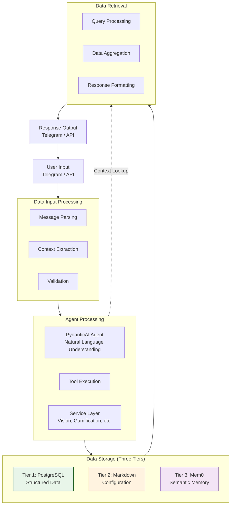
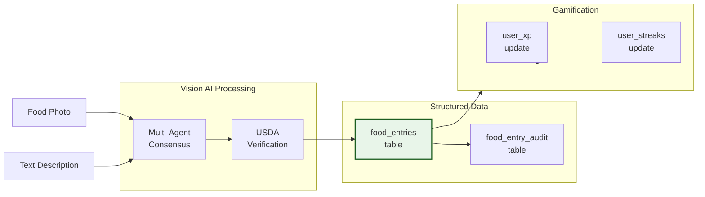
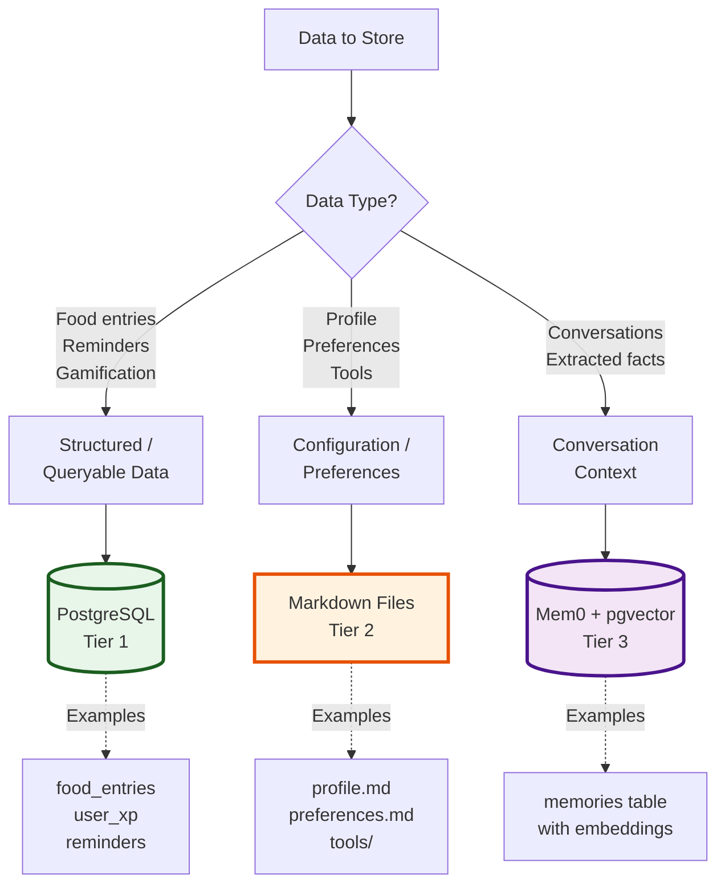
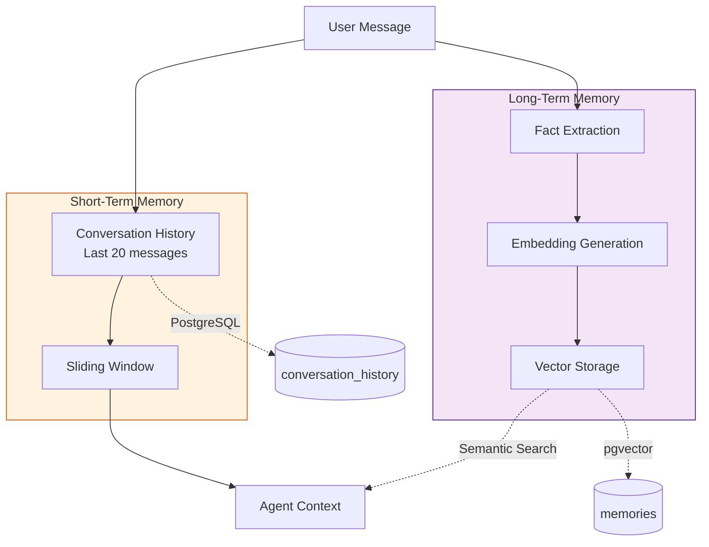
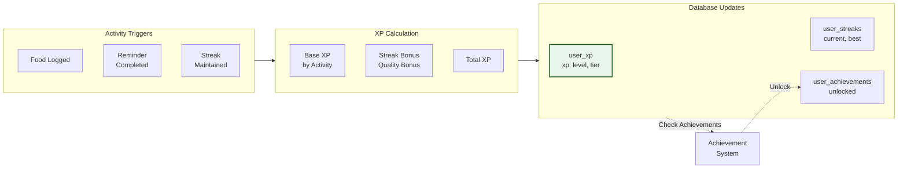
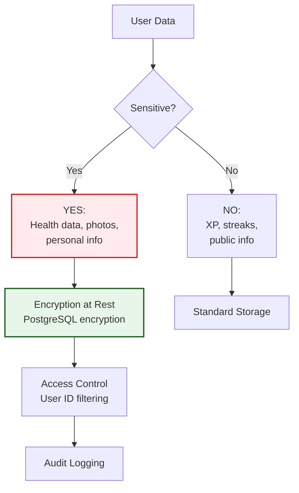

# Data Flow Diagram

This document illustrates how data moves through the Health Agent system, from user input to storage and retrieval.

---

## High-Level Data Flow



---

## Detailed Data Flows by Category

### 1. Food Entry Data Flow



**Flow Steps**:
1. User sends photo or text
2. Vision AI (multi-agent consensus) analyzes food
3. USDA verifies nutrition data
4. Food entry saved to `food_entries` table
5. Audit log created in `food_entry_audit`
6. Gamification triggers (XP award, streak update)

**Data Storage**:
- **PostgreSQL**: `food_entries`, `food_entry_audit`
- **File System**: Photo files in `production/photos/{user_id}/`
- **Mem0**: Memory of food preferences extracted

---

### 2. Memory Tier Routing Logic



**Decision Criteria**:
- **Tier 1 (PostgreSQL)**: Requires SQL queries, relationships, ACID guarantees
- **Tier 2 (Markdown)**: Human-readable config, rarely changes, key-value data
- **Tier 3 (Mem0)**: Semantic search needed, long-term context, extracted insights

---

### 3. Conversation History vs Semantic Memory



**Comparison**:

| Aspect | Conversation History | Semantic Memory |
|--------|---------------------|-----------------|
| Storage | PostgreSQL (`conversation_history`) | PostgreSQL with pgvector (`memories`) |
| Retrieval | Chronological (last N messages) | Semantic similarity search |
| Purpose | Recent context | Long-term insights |
| Lifespan | Rolling window (20 messages) | Persistent (deleted manually) |
| Size | ~5KB per conversation | ~10KB per memory |

---

### 4. Gamification Data Flow



**XP Calculation**:
```
total_xp = base_xp + streak_bonus + quality_bonus

base_xp:
- Food log (text): 50 XP
- Food log (photo): 75 XP
- Reminder completion: 25 XP
- Challenge completion: 100-500 XP

streak_bonus: min(current_streak × 5, 100)
quality_bonus: 0-50 (based on data completeness)
```

---

### 5. Query Aggregation Flow

When a user asks "What did I eat this week?", data is aggregated from multiple sources:

```mermaid
flowchart TD
    QUERY[User Query:<br/>"What did I eat this week?"]

    subgraph SOURCES["Data Sources"]
        DB_FOOD[(food_entries<br/>PostgreSQL)]
        DB_HABITS[(user_habits<br/>PostgreSQL)]
        MEM[Semantic Memories<br/>Mem0]
    end

    subgraph AGGREGATE["Aggregation"]
        SQL[SQL Query<br/>GROUP BY date]
        ANALYZE[Pattern Analysis]
        ENRICH[Enrich with<br/>Semantic Context]
    end

    subgraph FORMAT["Formatting"]
        SUMMARY[Daily Summaries]
        INSIGHTS[Insights<br/>"You ate more protein this week"]
        MARKDOWN[Markdown Table]
    end

    RESPONSE[Agent Response]

    QUERY --> DB_FOOD
    QUERY --> DB_HABITS
    QUERY --> MEM

    DB_FOOD --> SQL
    DB_HABITS --> ANALYZE
    MEM --> ENRICH

    SQL --> SUMMARY
    ANALYZE --> INSIGHTS
    ENRICH --> INSIGHTS

    SUMMARY --> MARKDOWN
    INSIGHTS --> MARKDOWN
    MARKDOWN --> RESPONSE
```

**Example Response**:
```
Here's what you ate this week:

Monday: 1,850 cal (95g protein, 180g carbs, 60g fat)
- Breakfast: Oatmeal with berries
- Lunch: Grilled chicken salad
- Dinner: Salmon with quinoa

Tuesday: 2,100 cal (110g protein, 200g carbs, 70g fat)
...

📊 Weekly totals: 13,500 cal, 680g protein
💡 Insight: You averaged 97g protein/day (above your 90g goal!)
```

---

### 6. Photo Storage and Retrieval

```mermaid
flowchart LR
    UPLOAD[Telegram Photo<br/>Upload]

    subgraph STORAGE["Storage"]
        DOWNLOAD[Download from<br/>Telegram Servers]
        SAVE[Save to Local<br/>File System]
        PATH[Generate Path:<br/>production/photos/<br/>{user_id}/{timestamp}.jpg]
    end

    subgraph DATABASE["Database Link"]
        FE_TABLE[food_entries.photo_path]
    end

    subgraph RETRIEVAL["Retrieval"]
        QUERY_DB[Query food_entry<br/>with photo_path]
        SERVE[Serve from<br/>File System]
    end

    UPLOAD --> DOWNLOAD
    DOWNLOAD --> SAVE
    SAVE --> PATH
    PATH --> FE_TABLE

    FE_TABLE --> QUERY_DB
    QUERY_DB --> SERVE

    style PATH fill:#fff3e0,stroke:#e65100,stroke-width:2px
```

**Storage Structure**:
```
production/
└── photos/
    └── {user_id}/
        ├── 2025-01-18_12-30-45_abc123.jpg
        ├── 2025-01-18_18-15-22_def456.jpg
        └── ...
```

**Cleanup Policy**:
- Photos older than 30 days archived to cold storage
- Archived photos compressed (JPEG quality 80 → 60)
- User can request photo deletion anytime

---

## Data Volume and Growth

### Current Production Metrics (Single User)

| Data Type | Count | Size | Growth Rate |
|-----------|-------|------|-------------|
| Food entries | ~500/month | 50KB/entry | ~25MB/month |
| Photos | ~300/month | 2MB/photo | ~600MB/month |
| Conversations | ~1000 messages/month | 1KB/message | ~1MB/month |
| Memories (Mem0) | ~100/month | 10KB/memory | ~1MB/month |
| **Total** | - | ~650MB/month | - |

### Projected Scaling (100 Users)

| Metric | Current (1 user) | Projected (100 users) |
|--------|------------------|----------------------|
| Database size | 100MB | 10GB |
| Photo storage | 10GB/year | 1TB/year |
| Daily food entries | 15-20 | 1,500-2,000 |
| Database queries/sec | <1 | 50-100 |

**Scaling strategies**: See `/docs/deployment/scaling.md`

---

## Data Security and Privacy

### Sensitive Data Handling



**Privacy Measures**:
- ✅ Telegram ID whitelist (only authorized users)
- ✅ All database queries filtered by `user_id`
- ✅ Food photos not shared externally
- ✅ Markdown files readable only by user
- ✅ API requires authentication (API key)
- ✅ No data sold to third parties

---

## Related Documentation

- **Component Diagram**: `/docs/architecture/component-diagram.md` - System structure
- **Sequence Diagrams**: `/docs/architecture/sequence-diagrams.md` - Interaction flows
- **Database Schema**: `/docs/api/database-schema.md` - Complete schema reference
- **ADR-002**: Three-tier memory architecture decision
- **MEMORY_ARCHITECTURE.md**: Detailed memory system documentation

## Revision History

- 2025-01-18: Initial data flow diagram created for Phase 3.7 documentation
