# System Sequence Diagrams

This document illustrates key interaction flows in the Health Agent system through sequence diagrams. Each diagram shows how components collaborate to fulfill user requests.

---

## 1. Food Photo Analysis Flow

This diagram shows the complete flow when a user sends a food photo for nutrition analysis.

```mermaid
sequenceDiagram
    participant U as User
    participant TB as Telegram Bot
    participant BH as Bot Handler
    participant A as PydanticAI Agent
    participant V as Vision AI<br/>(Multi-Agent)
    participant N as USDA Nutrition<br/>Service
    participant DB as PostgreSQL
    participant G as Gamification<br/>Service
    participant M as Mem0<br/>Memory

    U->>TB: Send food photo
    TB->>BH: photo_message event
    BH->>BH: Save photo to storage
    BH->>BH: Build conversation history
    BH->>A: "Analyze this food photo"<br/>[photo_path, conversation_history]

    Note over A: Agent decides to call<br/>analyze_food_photo tool

    A->>V: analyze_food_photo(photo_path)

    %% Multi-agent consensus
    Note over V: Parallel execution of 3 agents
    par Conservative Agent
        V->>V: Analyze (low estimate)
    and Moderate Agent
        V->>V: Analyze (balanced)
    and Optimistic Agent
        V->>V: Analyze (high estimate)
    end

    V->>V: Moderator synthesizes estimates
    V->>N: verify_with_usda(food_items)
    N-->>V: USDA nutrition data
    V->>V: Build consensus with USDA verification
    V-->>A: {foods, calories, protein, carbs, fat,<br/>confidence, reasoning}

    Note over A: Agent decides to call<br/>save_food_entry tool

    A->>DB: save_food_entry(user_id, foods, nutrition)
    DB->>DB: INSERT INTO food_entries
    DB-->>A: Entry saved (UUID)

    Note over DB,G: Database trigger fires

    DB->>G: food_entry_created event
    G->>G: Calculate XP (food logging + accuracy)
    G->>G: Check/update streak
    G->>DB: UPDATE user_xp SET xp = xp + 50
    G->>DB: UPDATE user_streaks SET current = 7
    G-->>A: {xp_gained: 50, streak: 7, level: 3}

    A->>M: add_memory(conversation)
    M->>M: Extract: "User ate chicken and rice"
    M->>DB: INSERT INTO memories (with embedding)
    M-->>A: Memory saved

    A-->>BH: Response: "Logged 450 calories, 30g protein...<br/>+50 XP! 7-day streak 🔥"
    BH->>BH: Format for Telegram (Markdown)
    BH-->>TB: reply_text(formatted_response)
    TB-->>U: Display nutrition analysis + XP notification
```

**Key Points**:
- Multi-agent consensus runs in parallel (conservative, moderate, optimistic)
- USDA verification adds ground-truth data
- Database trigger automatically awards XP and updates streaks
- Mem0 extracts important facts for long-term memory
- Total flow time: ~5 seconds (vision AI is the bottleneck)

---

## 2. Chat Message Processing Flow

This diagram shows how a simple text message is processed through the agent system.

**Key Points**:
- Context gathered from three memory tiers (Markdown, PostgreSQL, Mem0)
- Agent has full context before generating response
- Conversation history limited to 20 messages (context window management)
- Semantic memories supplement conversation history
- Total flow time: ~2 seconds

---

## 3. Reminder Scheduling and Triggering Flow

This diagram shows how reminders are created, scheduled, and triggered.

**Key Points**:
- Agent parses natural language into structured reminder parameters
- APScheduler handles cron-based scheduling
- Reminders persist in database (survive restarts)
- Completion tracking for gamification
- Reminders can be deactivated without deletion

---

## 4. Gamification XP Award Flow

This diagram shows how XP is awarded when a user completes health activities.

```mermaid
sequenceDiagram
    participant U as User
    participant TB as Telegram Bot
    participant A as PydanticAI Agent
    participant DB as PostgreSQL
    participant G as Gamification<br/>Service

    U->>TB: Complete health activity<br/>(food log, reminder, etc.)
    TB->>A: Activity completed event

    A->>DB: Save activity data<br/>(food_entry, reminder_completion, etc.)
    DB-->>A: Activity saved

    Note over DB,G: Database trigger OR<br/>explicit gamification call

    DB->>G: activity_completed event<br/>{user_id, activity_type}

    G->>DB: SELECT current XP, level, tier
    DB-->>G: {xp: 450, level: 3, tier: "Bronze"}

    G->>G: Calculate XP for activity:<br/>- Food log: 50 XP<br/>- Photo food log: 75 XP<br/>- Reminder completion: 25 XP<br/>- Streak bonus: +20 XP

    G->>G: Calculate new level:<br/>xp_for_next_level = level² × 100

    alt XP crosses level threshold
        G->>G: Level up! 3 → 4
        G->>G: Check tier promotion:<br/>Bronze (1-10), Silver (11-25), Gold (26-50)
        G->>DB: UPDATE user_xp<br/>SET xp=?, level=?, tier=?
        DB-->>G: Updated

        G->>G: Check for achievements:<br/>"Reach Level 5", "100 Foods Logged", etc.

        alt Achievement unlocked
            G->>DB: INSERT INTO user_achievements
            DB-->>G: Achievement saved
            G-->>A: {xp_gained: 70, level_up: true,<br/>new_level: 4, achievement: "Level Up!"}
        else No achievement
            G-->>A: {xp_gained: 70, level_up: true,<br/>new_level: 4}
        end
    else No level up
        G->>DB: UPDATE user_xp SET xp = xp + 70
        DB-->>G: Updated
        G-->>A: {xp_gained: 70, level_up: false}
    end

    A->>A: Format gamification response
    A-->>TB: "Food logged! +70 XP 🌟<br/>Level 4 reached! 🎉"
    TB-->>U: Display XP notification with celebration
```

**Key Points**:
- XP awarded based on activity type and quality
- Level calculation: `xp_required = level² × 100`
- Tier system: Bronze → Silver → Gold → Platinum
- Achievement system checks after each XP award
- Celebration animations for level ups and achievements

---

## 5. Multi-Agent Nutrition Consensus (Detailed)

This diagram zooms into the multi-agent consensus process for food photo analysis.

**Key Points**:
- Three specialists run in parallel (faster than sequential)
- Each agent has a different bias to ensure diverse perspectives
- Moderator uses Claude 3.5 Sonnet (better at synthesis)
- USDA verification grounds estimates in factual data
- Confidence level reflects agreement across estimates
- Reasoning explains the consensus process

---

## 6. User Onboarding Flow

This diagram shows the guided onboarding process for new users.

```mermaid
sequenceDiagram
    participant U as User
    participant TB as Telegram Bot
    participant A as PydanticAI Agent
    participant DB as PostgreSQL
    participant MM as Memory Manager

    U->>TB: /start
    TB->>A: Start command (new user)

    A->>DB: SELECT * FROM users WHERE telegram_id = ?
    DB-->>A: No user found

    A->>DB: INSERT INTO users (telegram_id)
    DB-->>A: user_id (UUID)

    A->>DB: INSERT INTO user_onboarding<br/>(user_id, state="welcome", path="standard")
    DB-->>A: Onboarding initialized

    A-->>TB: "Welcome! I'm your health coach.<br/>Let's get started. What's your name?"
    TB-->>U: Onboarding greeting

    U->>TB: "Alex"
    TB->>A: User response

    A->>DB: UPDATE user_onboarding SET state="collect_age"
    A->>MM: save_to_profile(name="Alex")
    MM-->>A: Saved

    A-->>TB: "Nice to meet you, Alex!<br/>How old are you?"
    TB-->>U: Next question

    U->>TB: "32"
    TB->>A: User response

    A->>MM: save_to_profile(age=32)
    A->>DB: UPDATE user_onboarding SET state="collect_goals"

    A-->>TB: "What are your health goals?"
    TB-->>U: Goals question

    U->>TB: "Lose 5kg and build muscle"
    TB->>A: User response

    A->>MM: save_to_profile(goals=["weight_loss", "muscle_building"])
    A->>DB: UPDATE user_onboarding<br/>SET state="complete", completed_at=NOW()

    A->>DB: Initialize gamification:<br/>INSERT INTO user_xp (user_id, xp=0, level=1)
    A->>DB: INSERT INTO user_streaks (user_id, current=0)

    A-->>TB: "Perfect! You're all set. 🎉<br/>Start by logging your first meal!"
    TB-->>U: Onboarding complete
```

**Key Points**:
- Onboarding state tracked in database (survives restarts)
- Profile data saved to Markdown files incrementally
- Gamification initialized on completion
- Guided conversation flow with state machine
- Total onboarding time: ~2-3 minutes

---

## 7. Error Handling and Recovery Flow

This diagram shows how the system handles errors gracefully.

**Key Points**:
- Automatic retry logic (configurable)
- Fallback to alternative LLM providers
- Graceful degradation (vision → text-based logging)
- User-friendly error messages with alternatives
- Error logging for monitoring and debugging

---

## Related Documentation

- **Component Diagram**: `/docs/architecture/component-diagram.md` - System structure overview
- **Data Flow Diagram**: `/docs/architecture/data-flow-diagram.md` - Data movement patterns
- **ADR-001**: PydanticAI framework decision
- **ADR-004**: Multi-agent nutrition consensus rationale
- **API Documentation**: `/docs/api/` - REST API specifications

## Revision History

- 2025-01-18: Initial sequence diagrams created for Phase 3.7 documentation
